## Commands Structure

The commands have been designed in a sub-command structure.

:grey_question: In any time it's possible to use the `-h`/`--help` flag to get help about the current command,
related sub-commands or/and options.

The main command is `clive` and it has sub-commands like `clive configure` or `clive show`.
The sub-commands can have sub-commands as well.

In the diagram below, all commands that can be run are enclosed in rectangles, while subcommands that require an
additional command are contained in rectangles with rounded corners. (i.e. only the top-down leafs are runnable
commands, the rest are sub-commands)

```mermaid
flowchart LR
    Clive[clive] --> Configuration
    Clive --> Presentation
    Clive --> Processing
    Clive --> BeekeeperRelated

    subgraph BeekeeperRelated[Beekeeper related commands]
        Beekeeper(beekeeper) --> BeekeeperSpawn[spawn]
        Beekeeper --> BeekeeperClose[close]
        Beekeeper --> BeekeeperInfo[info]
    end

   subgraph Processing[Commands related to performing certain actions]
        Process(process) --> ProcessTransfer[transfer]

        Process --> ProcessTransferSchedule[transfer-schedule]
        ProcessTransferSchedule --> ProcessTransferScheduleCreate[create]
        ProcessTransferSchedule --> ProcessTransferScheduleModify[modify]
        ProcessTransferSchedule --> ProcessTransferScheduleRemove[remove]

        Process --> ProcessTransaction[transaction]

        Process --> ProcessSavings(savings)
        ProcessSavings --> ProcessSavingsDeposit[deposit]
        ProcessSavings --> ProcessSavingsWithdrawal[withdrawal]
        ProcessSavings --> ProcessSavingsWithdrawalCancel[withdrawal-cancel]
        Process --> ProcessProxy[proxy]
        ProcessProxy --> ProcessProxySet[set]
        ProcessProxy --> ProcessProxyClear[clear]

        Process --> ProcessUpdateAuthority["update-[owner|active|posting]-authority"]
        ProcessUpdateAuthority --> ProcessUpdateAuthorityAddAccount[add-account]
        ProcessUpdateAuthority --> ProcessUpdateAuthorityAddKey[add-key]
        ProcessUpdateAuthority --> ProcessUpdateAuthorityModifyAccount[modify-account]
        ProcessUpdateAuthority --> ProcessUpdateAuthorityModifyKey[modify-key]
        ProcessUpdateAuthority --> ProcessUpdateAuthorityRemoveAccount[remove-account]
        ProcessUpdateAuthority --> ProcessUpdateAuthorityRemoveKey[remove-key]

        Process --> ProcessUpdateMemoKey[update-memo-key]

        Process --> ProcessPowerUp[power-up]
        Process --> ProcessPowerDown(power-down)
        ProcessPowerDown --> ProcessPowerDownStart[start]
        ProcessPowerDown --> ProcessPowerDownRestart[restart]
        ProcessPowerDown --> ProcessPowerDownCancel[cancel]
        Process --> ProcessWithdrawRoutes(withdraw-routes)
        ProcessWithdrawRoutes --> ProcessWithdrawRoutesSet[set]
        ProcessWithdrawRoutes --> ProcessWithdrawRoutesRemove[remove]
        Process --> ProcessDelegations(delegations)
        ProcessDelegations --> ProcessDelegationsSet[set]
        ProcessDelegations --> ProcessDelegationsRemove[remove]

        Process --> ProcessClaim(claim)
        ProcessClaim --> ProcessClaimNewAccountToken[new-account-token]

        Process --> ProcessVoteWitness(vote-witness)
        ProcessVoteWitness --> ProcessVoteWitnessAdd[add]
        ProcessVoteWitness --> ProcessVoteWitnessRemove[remove]

        Process --> ProcessVoteProposal(vote-proposal)
        ProcessVoteProposal --> ProcessVoteProposalAdd[add]
        ProcessVoteProposal --> ProcessVoteProposalRemove[remove]

        Process --> ProcessCustomJson(custom-json)
    end

    subgraph Presentation[Commands related to the presentation of the data]
        Show(show) --> ShowProfiles[profiles]

        Show --> ShowProfile[profile]

        Show --> ShowNode[node]

        Show --> ShowAccount[account]

        Show --> ShowAccounts[accounts]

        Show --> ShowKeys[keys]

        Show --> ShowBalances[balances]

        Show --> ShowTransactionStatus[transaction-status]

        Show --> ShowChain[chain]

        Show --> ShowProxy[proxy]

        Show --> ShowWitnesses[witnesses]
        ShowWitnesses ~~~|"witnesses:<br>- show witnesses the account votes for<br>- possible to list also proxy votes"| ShowWitnesses

        Show --> ShowWitness[witness]
        ShowWitness ~~~|"witness:<br>- show details of chosen witness"| ShowWitness

        Show --> ShowProposals[proposals]

        Show --> ShowProposal[proposal]
        ShowProposal ~~~|"proposal:<br>- show details of chosen proposal"| ShowProposal

        Show --> ShowHivePower[hive-power]

        Show --> ShowNewAccountToken[new-account-token]

        Show --> ShowPending(pending)
        ShowPending --> ShowPendingPowerDown[power-down]
        ShowPending --> ShowPendingPowerUps[power-ups]
        ShowPending --> ShowPendingRemovedDelegations[removed-delegations]
        ShowPending --> ShowPendingTransferFromSavings[withdrawals]

        Show --> ShowTransferSchedule[transfer-schedule]

        Show --> ShowAuthority["[owner|active|posting]-authority"]
        Show --> ShowMemoKey[memo-key]
    end

    subgraph Configuration[Configuration related commands]
        Configure(configure) --> ConfigureProfile(profile)
        ConfigureProfile --> CreateProfile[add]
        ConfigureProfile --> DeleteProfile[remove]
        ConfigureProfile --> SetDefaultProfile[set-default]

        Configure --> ConfigureTrackedAccount(tracked-account)
        ConfigureTrackedAccount --> AddTrackedAccount[add]
        ConfigureTrackedAccount --> RemoveTrackedAccount[remove]

        Configure --> ConfigureWorkingAccount(working-account)
        ConfigureWorkingAccount --> SetWorkingAccount[set]
        ConfigureWorkingAccount --> UnsetWorkingAccount[unset]

        Configure --> ConfigureKey(key)
        ConfigureKey --> AddKey[add]
        ConfigureKey --> RemoveKey[remove]

        Configure --> ConfigureNode(node)
        ConfigureNode --> SetNode[set]

        Configure --> ConfigureChainId(chain-id)
        ConfigureChainId --> SetChainId[set]
        ConfigureChainId --> UnsetChainId[unset]
    end
```

