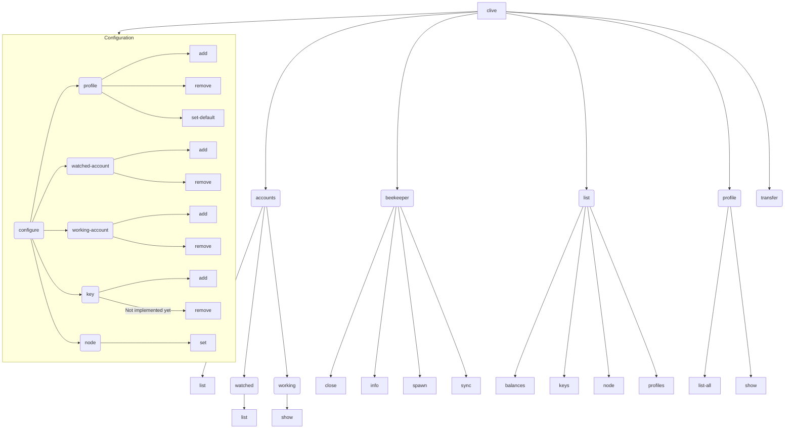

## Commands Structure

:grey_question: In any time it's possible to use the `-h`/`--help` flag to get help about the current command related
sub-commands
or/and options.

The commands have been designed in a sub-command structure.

The main command is `clive` and it has sub-commands like `clive accounts` or `clive profile`.
The sub-commands can have sub-commands as well. For example, `clive accounts` has sub-commands
like `clive accounts list` or `clive accounts watched`.

In the diagram below, all commands that can be run are enclosed in rectangles, while subcommands that require an
additional command are contained in rectangles with rounded corners.

